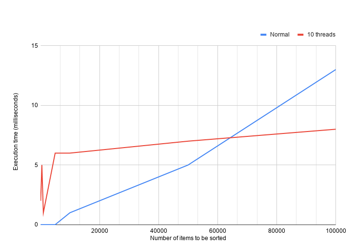
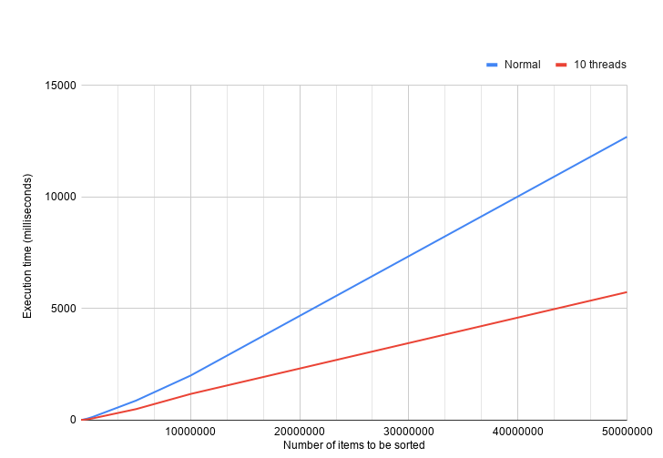

# Quicksort with multi-threads

## Introduction

Quicksort is a widely used sorting algorithm due to its performance and complexity: $O(n \cdot log(n)$. It is obvious that the more items, the more time takes to sort them.

Here I have implemented both the basic Quicksort algorithm and another version using multiple threads:
- The basic algorithm is based on the Hoare partition scheme.
- The multi-threads algorithm assigns each partition to a different thread.

For further details: https://en.wikipedia.org/wiki/Quicksort

## Results

The execution time is heavily conditioned by the size of the list. If the list is small, it is very likely that we do not need to parallize since the basic algorithm is fast enough.

The following chart shows the average time execution in $5$ runs on my computer and different list sizes with `Integer` objects:



As you can see, the inflection point happens around $60K$ items. If we keep increasing the list size, the difference between both algorithms is even bigger:



## Commands

#### Compile

```sh
sh manager.sh compile
```

#### Unit tests

```sh
sh manager.sh test
```

> Note: After running the unit tests, it generates an HTML with the coverage details at `./target/site/jacobo/index.html`. Anyway, I have attached a copy in `computed-coverage.zip`.

#### Run comparer

```sh
sh manager.sh run
```

## To do

- Optimize thread assignation in the `QuicksortManager` class.
- Implement all unit/functional tests.

---

Have fun! ᕙ (° ~ ° ~)
